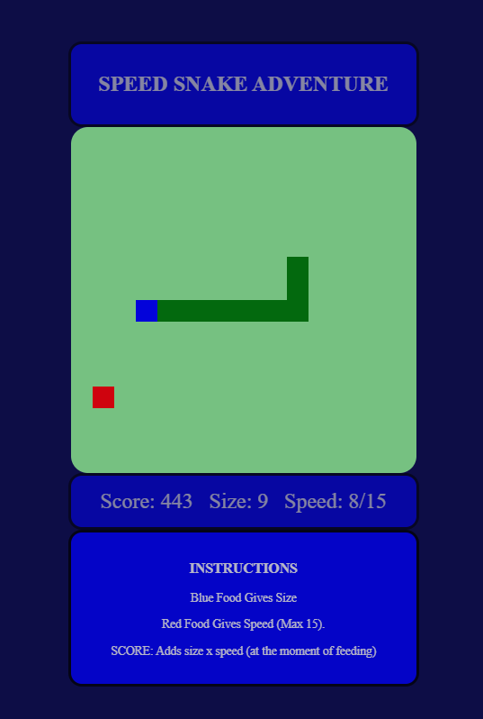

# Nibbles
A small 'nibbles' or 'snake' game project on JS for Digital Innovation One's Web Bootcamp

### Differences From the Original Project

- Some variables were converted from *let* to *const* (canvas, context and box variables);
- Broke the game tasks (snake, background, main) in different files for code cleaning purposes;
- Used a switch instead of a chain of if's to control the snake + direction behavior.
- Changed the depricated 'event' parameter to 'e'.
- A separate function was created to control the snake behavoir, so that 'update' function only calls functions and has no other responsibilities of it's own.
- Added 'wasd' command option.
- Added blue food which increases game speed, using 'clearInterval' to create a dynamic game speed.
- Added a scoreboard.
- Added a mechanism to avoid spawning food on a position already occupied by the snake (or by another food piece)
- Significantly changed CSS style.
- Game ressets and restarts after gameover.

